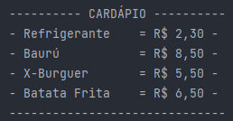
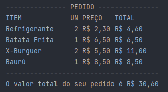
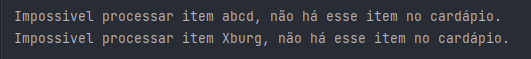

# Lanchonete

<div align="center">

 
|                           Java 11                             |
|                            :---:                              |
|  |  

| Status do Projeto  | 
|        :---:       | 
| Em desenvolvimento | 

|                    [Kyara Araújo](https://github.com/kyaraaraujo)                     |
|                                     :---:                                             |
|  |  

<br>


Impressão do cardápio:



Impressão do pedido válido:



Impressão do pedido inválido:



</div>


---

[Objetivo](#objetivo) &nbsp;&nbsp; | &nbsp;&nbsp;
[Aprendizados](#aprendizados) &nbsp;&nbsp; | &nbsp;&nbsp;
[Preocupações de qualidade](#preocupações-de-qualidade) &nbsp;&nbsp; | &nbsp;&nbsp;
[Como usar](#como-usar) &nbsp;&nbsp; | &nbsp;&nbsp;
[Informações Extras](#informacoes-extras) &nbsp;&nbsp; | &nbsp;&nbsp;
[Referências](#referências) &nbsp;&nbsp;

<br>

## Objetivo:
O objetivo deste projeto é praticar programação orientada à objetos com Java e utilizar como consulta de estudo.
Simula uma lanchonete: ver itens do cardápio, realizar pedidos, verificar itens do pedido, assim como o valor unitário, quantidade, valor total de cada item e valor total à pagar.

## Aprendizados/Utilizado
- Programação Orientada à Objeto
- Manipulação de Map e List. 

## Preocupações de Qualidade
- Leitura fácil do código
- Limite de responsabilidade dos métodos
- Nomes de variáveis auto explicativas
- Testes dos métodos (separados em classes de teste)
- Formatação da impressão para melhor visualização dos resultados


## **Como Usar**
- Ter o JDK instalado
- Para compilar e executar:
  - [Opção 1]: através de uma IDE que possa compilar e executar Java (ex: IntelliJ, Eclipse, VS Code + plugins).
  - [Opção 2]: Caso deseje compilar e executar pelo terminal:
    - será necessário [configurar as variáveis de ambiente no Windows.](https://medium.com/@biel_moita/por-que-criar-vari%C3%A1veis-de-ambiente-para-o-java-no-windows-d83c9ec7c39c)
- Após executar as classes do pacote test, os resultados serão impressos no console.


## Informações Extras
Outra forma de obter chaves e valores do Map
```java
        for (Map.Entry<String, Double> entry : meuMap.entrySet()) {
            System.out.println(entry.getKey() + " " + entry.getValue());
        }
```


Para ver todos os valores do map sem usar for.
```java
    Collection valoresMeuMap = meuMap.values();
    System.out.println(valoresMeuMap);
```

## Referências
- [Inicialização de Map](https://qastack.com.br/programming/6802483/how-to-directly-initialize-a-hashmap-in-a-literal-way)
- [Documentação Java sobre Map](https://docs.oracle.com/en/java/javase/11/docs/api/java.base/java/util/Map.html)

---
⬆ [Voltar ao início](#lanchonete)

<br><br>
